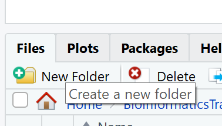

```{r, echo=FALSE, purl=FALSE, message = FALSE}
source("setup.R")
surveys <- read.csv("data/portal_data_joined.csv")
suppressWarnings(surveys$date <- lubridate::ymd(paste(surveys$year,
                                                     surveys$month,
                                                      surveys$day,
                                                      sep = "-")))
```

# Data exploration workflow
When you are working on a project that requires data analysis, you will normally need to perform the following steps:


More information on this workflow can be found in the [R for Data Science](https://r4ds.had.co.nz/) book.  To understand better the workflow in the illustration above, let us go over each stage to see what each step entails:

1.  The first step in working with data is to first **import** your data into R.  This connects the external file/database to your project in R.
2.  **Cleaning** or **tidying** the data will follow, which involves making sure that the data is consistent and that each row in the dataset is an observation and each column is a variable.  
_e.g._ In the _surveys_ data frame the _month_ column specifies months as an integer from 1 to 12.  The dataset would have inconsistent data if there was a record in the dataset that had a month specified by name, _e.g._ September rather than 9.  A month of 0 or any other number that is not in the range 1 to 12 would have also made the dataset inconsistent.  Another common problem is capitalisation; the same word in the same column can be written with capitals or without; _e.g._ _Bird_ or _bird_ in the same _taxa_ column is inconsistent data.  During the _tidying_ stage it is important to make the dataset consistent and much as possible so that you can focus on the questions you are trying to solve in your analysis.  
<!--image showing that each row is an observation and that column is a variable-->
3.  Once the dataset is tidy, we move to the transformation stage.  To be able to **transform** your data you need to plan in advance what analyses you would like to perform on the dataset and what plots you would like to create.  In this way, you are able to plan ahead what variables/columns you will be using from the dataset, what additional variables you will need to create and what variables you will not be using so that you can keep only the columns in the dataset that are relevant for your analyses.  By the end of the transformation process you will have a dataset that is focused for your analyses and you can move on to the main exploratory mechanisms of this workflow which are visualisation and modelling.  These two stages complement each other and when exploring your data you normally repeat these two stages several times.    
4.  **Visualising** data is a powerful way to explore your data.  Furthermore it helps you understand if there is any pattern in the data.   
5.  **Modelling** the data involves applying statistics or other mathematical or computational models on your data to explore if there are correlations or patterns in the dataset to help you answer the scientific question you are trying to solve.  
6.  The last step in the data exploration workflow is to **communicate** your results.  This is very important as you will need to be able to communicate your results to others to have a successful project.

All these stages in the data exploration workflow can be achieved by programming in R.  In this course we will not look into the _Model_ and _Communicate_ stages of the workflow in this course.  You will be able to learn more about these in the following courses:

* Model:  [Statistics for Biologists in R](https://training.cam.ac.uk/bioinformatics/event/2815748) and [An Introduction to Machine Learning](https://training.cam.ac.uk/bioinformatics/event/3043850) 
* Communicate: [Reproducible Research with R](https://training.cam.ac.uk/bioinformatics/event/3114638)

In the next sections we will be looking at the _import_, _tidy_, _transform_ and _visualise_ stages of the data exploration workflow by using one of the most popular packages in data science in R; **Tidyverse**.

<!--image of model with tidyverse hexagons under the ones that we will be covering in this course-->.  

# Packages
So far we have learnt how to use R with R's in-built functionality that we will refer to as **R Base**.  There is a way, however, to extend this functionality by using external functions through **packages**.  Packages in R are basically sets of additional functions that let you do more stuff. The functions we've been using so far, like `str()` or `head()`, come built into R; packages give you access to more of them.  Below is an illustration of the concept of a package.  

<!--image of a package with functions in it-->

## Tidyverse
The package that we will be using in this course is called tidyverse.  It is an "umbrella-package" that contains several packages useful for data manipulation and visualisation which work well together such as **`readr`**, **`tidyr`**, **`dplyr`**, **`ggplot2`**, **`tibble`**, etc...  

<!--image of tidyverse-->

Tidyverse is a recent package (launched in 2016) when compared to _R base_ (stable version in 2000), thus you will still come across R resources that do not use _tidyverse_.  However, since its' release, _tidyverse_ has been increasing in popularity throughout the R programming community and it is now very popular in Data Science as it was designed with the aim to help Data Scientists perform their tasks more efficiently.  

Some of the main advantages of _tidyverse_ over _R base_ are:

1. **Easier to read **
<p>Bracket subsetting is handy, but it can be cumbersome and difficult to read, especially for complicated operations.</p>
<!--https://www.onthelambda.com/2014/02/10/how-dplyr-replaced-my-most-common-r-idioms/-->
_e.g._ Get only the rows that have species as albigula surveyed in the year 1977.
```{r, echo=TRUE, results=FALSE}
# R Base
surveys[surveys$species=="albigula" &
        surveys$year==1977, ]

# tidyverse
filter(surveys, species=="albigula", year==1977)
```
2. **Faster**
<p>Using tidyverse is up to 10x faster[^1] when compared to the corresponding base R base functions.</p>
3. **Strings are not converted to `factor`**
<p>We have seen in our previous lesson that when building or importing a data frame, the columns that contain characters (_i.e._, text) are coerced (=converted) into the `factor` data type. We had to set **`stringsAsFactors`** to **`FALSE`** to avoid this hidden argument to convert our data type. With tidyverse, this does not happen.

[^1]: https://readr.tidyverse.org/
</p>

<br/>

### Installing and loading packages

Before using a package for the first time you will need to install it on your machine, and then you should import it in every subsequent R session when you need it. To install a package in R on your machine you need to use the `install.packages` function.  To install the `tidyverse` package type the following straight into the console:  
```{r, eval=FALSE, purl = FALSE}
#install the tidyverse package
install.packages("tidyverse")
```
It is better to install packages straight from the console then from your script as there's no need to re-install packages every time you run the script.

Then, to load the package type:
```{r}
## load the tidyverse package
library(tidyverse)
```

<br/>

# Importing/Reading data from files


After loading the `tidyverse` package in R we are now able to use its' functions.  We will start working through the data exploration workflow by first importing data into R.  To import the data into R as before, we will now use the `read_csv` function, from the tidyverse package **`readr`**, instead of using `read.csv` from `R base`.  The `readr` package contains functions to read tabular data into R.  Let us read in the same file we used before using `tidyverse` this time:
```{r, eval=TRUE, message=FALSE}
surveys <- read_csv("data/portal_data_joined.csv")
```
<br/>

## Tibble

After importing data into R we need to check if the data has been loaded into R correctly.
```{r, eval=TRUE, results=TRUE, purl=FALSE}
## display the first 6 rows of the dataset
head(surveys)
```
Notice that the first line of the output shows the data structure used to store the data imported into: **`tibble`**. `tibble` is the main data structure used in `tidyverse`.  You can look at `tibble` as the `data.frame` version of `tidyverse`. The first immediate difference from a `data.frame` is that a `tibble` displays the data type of each column under its name and it only prints as many columns as fit on one screen.  Furthermore as mentioned before, the columns of class `character` are never converted into `factor`.  Another difference is that printing a `tibble` will not print the whole dataset, but just the first 10 rows and only the columns that fit the screen (same as `head` but with 10 rows instead of 6).  If you would like to print more than the first 10 rows use the `print` function.

```{r, results=TRUE}
#print the first 15 rows
print(surveys, n=15)
```

Since printing `tibble` already gives you information about the data structure, the data types of each column and the size of the dataset, the `str` function is not as much useful as it was when using `data.frame`.  
```{r, results=TRUE}
## inspect the data
str(surveys)
```

Notice that rather than specifing `tibble` as the data structure of surveys, the first line of `str`'s output now specifies `‘spec_tbl_df’, ‘tbl_df’, ‘tbl’ and 'data.frame'` which can be a bit confusing. These are the classes `tibble` inherts from which in simple terms means that `tibble` is a `data.frame` with a few modifications.  Therefore, most of the functions that were used with `data.frame` can also be used with `tibble`.

<br />

# Visualising data in R


After inspecting the `surveys` dataset in R, the data looks tidy and we are happy with its format, so let us start understanding better our data by visualising it.  **`ggplot2`** is the visualisation package in `tidyverse` and we will be using this to create some plots.  `ggplot2` is a very popular package used for plotting mainly due to its simple way to create plots from tabular data.  

To create a plot, we will use the following basic template. 
```
ggplot(data = <DATA>, mapping = aes(<MAPPINGS>)) +  <GEOM_FUNCTION>()
```
As you can see there are 3 main elements that you need to create a plot:

The `ggplot` function takes 2 arguments:

* **data**: This is the data frame to attach to the plot.  The data frame must contain the variables to plot as columns and the rows must contain the observations that you need to plot.
* **mapping**: Aesthetic mappings describe how variables in the data are mapped to visual properties of the plot.  

Using the `ggplot` function on its own will not plot anything. We need to add a **geom_function** as a layer. Layers are added to plots by using `+`.  They are added on top of the other previous layers that might be present.    

* **geom_function**: This specifies the type of plot would you like to plot.  The greatest advantage of this is that you can easily change the plot type by just changing the geom_function and keeping everything else the same.  You can see a whole list of plots that you can plot  [here](https://ggplot2.tidyverse.org/reference/index.html#section-layer-geoms).

Let us practice this on our `surveys` dataset. We would like to create a scatter plot with `weight` on the x-axis, `hindfoot_length` on the y-axis 

```{r}
ggplot(data = surveys, mapping = aes(x = weight, y = hindfoot_length))
```

## Adding layers

As you can see if you just specify the `ggplot` function with the data and aesthetic mappings, it will just create an empty plot.  Let us now add the geom_function for the scatter plot (`geom_point`) as a layer to the plot:
<a name="firstplot"></a>
```{r, message=FALSE, warning=FALSE}
ggplot(data = surveys, mapping = aes(x = weight, y = hindfoot_length)) +
  geom_point()
```

You can customise some of the visualisations of the plot to extract more information from it.  For instance, we can add transparency (`alpha`) to avoid overplotting:

```{r adding-transparency, message=FALSE, warning=FALSE, fig.show=TRUE}
ggplot(data = surveys, mapping = aes(x = weight, y = hindfoot_length)) +
    geom_point(alpha = 0.1)
```

You can find a list of aesthetics for each type of plot in the [ggplot2 cheat sheet](https://github.com/rstudio/cheatsheets/blob/master/data-visualization-2.1.pdf).  

We can also add colors for all the points:

```{r adding-colors, message=FALSE, warning=FALSE, fig.show=TRUE}
ggplot(data = surveys, mapping = aes(x = weight, y = hindfoot_length)) +
    geom_point(alpha = 0.1, color = "blue")
```

If we would like to try other type of plots on the data, the best thing is to save the ggplot into a variable as below:

```{r, fig.show="hide", message=FALSE, warning=FALSE}
# Assign plot to a variable
surveys_plot <- ggplot(data = surveys, 
                       mapping = aes(x = weight, y = hindfoot_length))

# Draw a scatter plot
surveys_plot + 
    geom_point()
```

Now draw a `geom_smooth` plot.  This plot is good when you need to see if there is any pattern between the two variables being plotted that you would not normally see in a scatter plot due to overplotting.
```{r, message=FALSE, warning=FALSE}
surveys_plot +
    geom_smooth()
```

Rather than seeing each plot separately, sometimes plotting multiple plots on top of each other is a better way. You can add multiple plots as layers on top of each other as follows:

```{r, message=FALSE, warning=FALSE}
surveys_plot +
  geom_point() +
  geom_smooth()
```

>**Note**
>
>- Anything you put in the `ggplot()` function can be seen by any geom layers that you add (_i.e.,_ these are universal plot settings). 
>- You can also specify mappings for a given geom independently of the mappings defined globally in the `ggplot()` function.
>- The `+` sign used to add new layers must be placed at the end of the line containing the *previous* layer. If, instead, the `+` sign is added at the beginning of the line containing the new layer, >**`ggplot2`** will not add the new layer and will return an error message.
>
>```{r chunkT, eval=FALSE, purl=FALSE}
># This is the correct syntax for adding layers
>surveys_plot +
  geom_point()
>
># This will not add the new layer and will return an error message
>surveys_plot 
  + geom_point()
>```

> ### Challenge 
>
> Scatter plots can be useful exploratory tools for small datasets. For data
> sets with large numbers of observations, such as the `surveys` data
> set, overplotting of points can be a limitation of scatter plots. We have already seen how we can
> visualise data better when we have overplotting with the `geom_smooth` plot. Another way 
> for handling overplotting is to display the density of the data through contours.  As this challenge's task
> create a script called `plot_density2d.R` which loads the file data/portal_data_joined.csv into the variable `surveys`.  It then uses this dataset to plot the `weight` on the x-axis and `hindfoot_length` on the y-axis in a `geom_density2d` plot.
>
> ```{r, fig.show="hide", answer=TRUE, message=FALSE, warning=FALSE, purl=FALSE}
>library(tidyverse)
>
>#load the surveys data
>surveys <- read_csv("data/portal_data_joined.csv")
> 
>#attach data and map x and y axes
>surveys_plot <- ggplot(data = surveys, 
>                       mapping = aes(x = weight, y = hindfoot_length))
>#draw geom_density2d
>surveys_plot +
> geom_density2d()
>```


## Saving a plot to a file {#saveplot}

To save a plot to file use the `ggsave` function.  If you look at the [documentation of ggsave](https://ggplot2.tidyverse.org/reference/ggsave.html) you can see the different arguments the ggsave function takes.  Let us save the plot present in the surveys_plot variable into a file called `plot_weight_hindfoot_density2d.png` into a folder in this project called `img_output`.  
```{r, warning=FALSE, message=FALSE}
#save plot that you would like to save into a variable
out_plot <- surveys_plot + geom_density2d()
#save plot to file
ggsave(filename="img_output/plot_weight_hindfoot_density2d.png", plot=out_plot)
```

>**Note**
>
>- You do not need to save the plot into a variable before saving it to file.  If you do not specify the `plot` argument of the `ggsave` function, `ggsave` will take the last plot that you plotted and save it into the `filename` specified.
>```{r, warning=FALSE, message=FALSE}
>#save plot to file
>ggsave(filename="img_output/plot_weight_hindfoot_density2d.png")
>```
>
>- You can create folders straight from RStudio from the right bottom pane in the Files section > New Folder icon.
>
>

<br/>

# Transforming data - dplyr
In most of the cases you will need to change the format of your dataset because it will not be in the right format that you will need to plot or analyse the data.  `tidyverse` has a package called `dplyr` which contains functions that help you to select columns/rows, sort, combine and perform other data types of data transformations. In the next sections we will look at different ways to transform our dataset.  Now that we already know the basics of visualing data with `ggplot` we will also learn how to visualise other plots with the transformed dataset as we go along.  

>To learn more about `dplyr` please look at the following resources:
>
>- [dplyr cheat sheet](https://github.com/rstudio/cheatsheets/blob/master/data-transformation.pdf)
>- [dplyr documentation](https://dplyr.tidyverse.org/)
>
>If you find these resources difficult to understand, return to these after completing the course.

<br/>

## Selecting columns

To select columns of a data frame or tibble, use the`select` function. The first argument
is the data frame or tibble you are working on (in our example it is `surveys`), and the subsequent arguments are the columns to keep.

```{r, eval=FALSE}
#extract species_id, weight, hindfoot_lenth, year and sex columns from surveys dataset.
select(surveys, species_id, weight, hindfoot_length, year, sex)
```

To select all columns *except* certain ones, put a `-` in front of the column to exclude it.

```{r, eval=FALSE}
#select all columns of the surveys dataset apart from record_id and species_id columns.
select(surveys, -record_id, -species_id)
```

<br/>

## Filtering rows

To remove rows from a data frame or tibble use the `filter` function from the `dplyr` package.  The first argument is the data frame or tiblle to perform the filtering on and the next arguments are the conditions on which to keep the rows. 

### Filtering rows by values

To choose rows based on a specific condition, use the `filter` function as follows:

```{r, eval=FALSE}
#keep only the observations of animals collected from 1995 onwards from the surveys dataset.
filter(surveys, year >= 1995)
```

You can filter on multiple conditions:
```{r, eval=FALSE}
#keep only the observations of animals collected from 1995 onwards
#that are female from the surveys dataset.
filter(surveys, year>=1995, sex=="F")
```

### Remove rows with `NA` (missing) values

When we were plotting `weight` against `hindfoot_length` in the previous section, you must have noticed that we were getting a warning message:
```{r, fig.show="hide", echo=FALSE}
# Assign plot to a variable
surveys_plot <- ggplot(data = surveys, 
                       mapping = aes(x = weight, y = hindfoot_length))

# Draw a scatter plot
surveys_plot + 
    geom_point()
```

This is because some of the values in the `weight` and `hindfoot_length` are `NA`.  `NA` is short for **Not Available** and essentially it means that there is no data for that particular index in the table.  We also refer to this as **missing data**.  `ggplot` does not plot the observations that have missing data and outputs the warning above which shows the number of observations that have missing data in the dataset we are plotting.  We can filter these rows before we plot them so that `ggplot` will have all the values for the observations it is plotting and so no warning will be disaplyed.

The `is.na` function returns `TRUE` if the value passed to it is `NA`.  Applied to a vector or data frame it will return `TRUE` or `FALSE` for each index in the vector or data frame depending on whether the value at each index is missing or not.   The `!` symbol negates the result, so `!is.na` can be interpreted as **is not NA**.  See how this can be used in the code below:

```{r, eval=FALSE}
#which values of the weight column are missing?
is.na(surveys$weight)

#which values of the weight column are not missing?
!is.na(surveys$weight)
```

Now let us apply the `is.na` function in `dplyr`'s `filter` function to remove the rows that have `weight` or `hindfoot_length` as `NA` from the `surveys` tibble.

```{r, eval=FALSE}
filter(surveys, 
  !is.na(weight), #remove rows that have weight as NA
  !is.na(hindfoot_length))  #remove rows that have hindfoot_length as NA
```
Another way to remove rows that have `NA` values is by using the `drop_na` function in the `tidyr` package.  The code above can be replaced by the following code which gives the same answer:
```{r}
drop_na(surveys, weight, hindfoot_length)
```

Using `drop_na()` without specifying any columns will remove all the rows that have `NA` in any of the columns.
```{r}
drop_na(surveys)
```
Let us save the results of this in `surveys_complete` variable which contains only the rows that have all the values in all the columns present and use this for the remaining of the course.
```{r}
surveys_complete <- drop_na(surveys)
```

<br/>

## Pipes

What if you want to `select` and `filter` at the same time? 
There are three ways to do this:

- use intermediate steps
- nested functions
- pipes

With intermediate steps, you create a temporary data frame and use
that as input to the next function, like this:

```{r, eval=FALSE}
surveys2 <- select(surveys_complete, species_id, weight, hindfoot_length, year, sex)
surveys_recent <- filter(surveys2, year >= 1995)
```

This is readable, but can clutter up your workspace with lots of objects that you have to name individually. With multiple steps, that can be hard to keep track of.

You can also nest functions (*i.e.,* one function inside of another), like this:

```{r, eval=FALSE}
surveys_recent <- filter(
                    select(surveys_complete, species_id, weight, hindfoot_length, year, sex)
                    , year >= 1995)
```

This is handy, but can be difficult to read if too many functions are nested, as
R evaluates the expression from the inside out (in this case, selecting, then filtering).

The last option, **pipes**, are a recent addition to R. Pipes let you take
the output of one function and send it directly to the next, which is useful
when you need to do many things to the same dataset.  Pipes in R look like
`%>%` and are made available via the **`magrittr`** package, installed automatically
with `dplyr`. 

```{r, eval=FALSE}
surveys_complete %>%
  select(species_id, weight, hindfoot_length, year, sex) %>%
  filter(year >= 1995)
```

In the above code, we use the pipe to send the `surveys_complete` dataset first through `select` and then through `filter`.  Some may find it helpful to read the pipe like the word "then". For instance, in the above example, we took the tibble `surveys_complete`, *then* we `select`ed columns `species_id`, `weight`, `hindfoot_length`, `year`and `sex`.  We then `filter`ed the rows and only kept the ones that have `year >= 1995`. 

Since `%>%` takes the object on its left and passes it as the first argument to the function on its right, we don't need to explicitly include the data frame/tibble as an argument to the `select` and `filter` functions any more. This is one of the biggest advantages of using pipes as it allows us to perform all the operations that we need to do with the need to create useless variables and store useless data.  Furthermore, the code is more readable when using pipes.  The `dplyr` functions by themselves are somewhat simple, but by combining them into linear workflows with the pipe, we can accomplish more complex manipulations of data frames/tibbles.

If we want to create a new object with the transformed data we can assign it a new name as below:

```{r, eval=FALSE}
surveys_recent <- surveys_complete %>%
                  select(species_id, weight, hindfoot_length, year, sex) %>%
                  filter(year >= 1995)

surveys_recent
```


> ### Challenge 1 - pipes
>
>Subset the `surveys_complete` data to keep only the `species_id`, `weight`, `hindfoot_length`, `year` and `sex` columns and the animals collected on and after 1995.  Then plot a scatter plot of `weight` (x-axis) against `hindfoot_length` (y-axis) using this transformed dataset.
>Do all the above using pipes, without creating any variables.
>
>```{r, answer=TRUE, eval=FALSE}
>surveys_complete %>%
>  #select columns
>  select(species_id, weight, hindfoot_length, year, sex) %>%
>  #filter rows
>  filter(year >= 1995) %>%
>  #plot transformed data
>  ggplot(mapping=aes(x=weight, y=hindfoot_length)) +
>    geom_point()
>```


>### Challenge 2 - plotting subset with different colour
>
>Plot all the animals in the `surveys_complete` dataset as `weight` (x-axis) against `hindfoot_length` (y-axis).  Use the dataset created above which contains only the animals that were collected on and after 1995 and highlight these points in red in the plot.
>
>```{r, answer=TRUE, eval=FALSE}
>survey_recent <- surveys_complete %>%
                  select(species_id, weight, hindfoot_length, year, sex) %>%
                  filter(year >= 1995)
>ggplot(mapping=aes(x=weight, y=hindfoot_length)) +
>  geom_point(data=surveys_complete) +
>  geom_point(data=survey_recent, aes(color="red")) +
>  #remove lengend
>  theme(legend.position = "none") 
>```
>**Note:** In the example above we did not specify the `data` argument in the `ggplot` function because the arguments in the `ggplot` function should be common throughout the whole plot.  In this case we specified the respective data as separate layers in 2 different `geom_point` plots; the first plot is the data with all the animals in `surveys_complete` (points in black), the second plot is layered on top of the first plot which is a subset of the `surveys_complete` dataset (points in red).

<br/>

## Creating new columns

Frequently you'll want to create new columns based on the values in existing columns, for example to do unit conversions, or to find the ratio of values in two columns. For this we'll use the `mutate` function.  

To create a new column of weight in kg:

```{r, purl = FALSE}
surveys_complete %>%
  mutate(weight_kg = weight / 1000)
```

You can also create a second new column based on the first new column within the same call of `mutate()`:

```{r, purl = FALSE}
surveys_complete %>%
  mutate(weight_kg = weight / 1000,
         weight_kg2 = weight_kg * 2)
```

There are other ways on how to create new columns.  Refer to the dplyr cheat sheet *Make New Variables* section. 

<br/>

> ### Challenge - the boxplot
>
> Using the `surveys_complete` dataset, create a [boxplot](https://ggplot2.tidyverse.org/reference/geom_boxplot.html) for each year on the x-axis and weight in kg on the y-axis. Use the subset dataset that was transformed in the previous challenge, *i.e.* the one that has the recent observations (from 1995 onwards).  As before try to do all the operations using pipes, without creating variables.  
> **Hint**:  You will need to use the `mutate_at` function to convert the `year` column to `factor` type.
>
> **Answer**
> 
>Your first attempt would be to use the code we used before to subset the `surveys_complete` dataset, but also adding the `mutate` function to add a new `weight_kg` column. Further more you will need to also add the `ggplot` function to draw a boxplot:
>
>```{r}
>surveys_complete %>%
>  #add weight_kg column
>  mutate(weight_kg = weight / 1000) %>%
>  #select columns
>  select(species_id, weight_kg, hindfoot_length, year, sex) %>%
>  #filter rows
>  filter(year >= 1995) %>%
>  #plot transformed data
>  ggplot(mapping=aes(x=year, y=weight_kg)) +
>    geom_boxplot()
>```
>
>You might notice that this code produces a warning message about the continuous data type of the x-axis and also creates a box plot with one single box and whisker averaged over all the years on the x-axis, rather than one for each year in the dataset as requested.  As shown in the [`ggplot2` cheat sheet](https://github.com/rstudio/cheatsheets/blob/master/data-visualization-2.1.pdf), box plots display a discrete variable on the x-axis and a continuous variable on the y-axis.  At the moment `year` is treated as a continuous variable since its data type is `double`  (you can see this from the tibble).  To fix this, we need to convert the data type of the `year` column to a categorical one (`factor`) so that each year can be plotted as a separate box and whisker.  `dplyr` has the [`mutate_at`](https://dplyr.tidyverse.org/reference/mutate_all.html) function which does just that; it applies a function that you specify to the column/s of your choice.  Below is the updated code which includes the call to the `mutate_at` function. 
>
>```{r}
>surveys_complete %>%
>  #add weight_kg column
>  mutate(weight_kg = weight / 1000) %>%
>  #select columns
>  select(species_id, weight_kg, hindfoot_length, year, sex) %>%
>  #filter rows
>  filter(year >= 1995) %>%
>  #convert the year column to a factor
>  mutate_at(.vars="year", .funs=factor) %>%
>  #plot transformed data
>  ggplot(mapping=aes(x=year, y=weight_kg)) +
>    geom_boxplot()
>```
>
>Notice that since we need to keep only observations that have been observed from 1995 onwards, we need to convert the `year` column to a `factor` *after* we filter the rows, as otherwise the row filtering operation will not be possible.  This is because the new `year` column of type `factor` does not have any ordering in its categories so perfoming `year >= 1995` would not be possible.
>
> **Note on the boxplot**
>
>As mentioned the boxplot is used to visualise the distribution of a continuous variable.  In the example above we displayed the distribution of `weight` over the different years.  The figure below illustrates the different components of the boxplot. The bottom line of the box represents the 25th quantile, middle line the 50th quantile (or median) and the top line of the box is the 75th quantile. The whiskers can be thought of as defining the boundary of the confidence intervals of the distribution.  The dots outside these whiskers are the outliers.  
>
><center></center>
>

<br/>

## Sorting data

To sort your data `dplyr` provides function `arrange`.  
```{r}
#sort weight in ascending order
surveys_complete %>%
  arrange(weight)
```
```{r, echo=FALSE, results=TRUE, layout="l-body-outset"}
library(rmarkdown)
paged_table(surveys_complete %>% arrange(weight))
```

To sort your data in descending order you will need to use `desc()`.
```{r}
#sort weight in descending order 
surveys_complete %>%
  arrange(desc(weight))
```
```{r, echo=FALSE, results=TRUE, layout="l-body-outset"}
library(rmarkdown)
paged_table(surveys_complete %>% arrange(desc(weight)))
```

You can sort your dataset based on the values of multiple columns:
```{r}
#sort weight in ascending order and hindfoot_length in descending order
surveys_complete %>%
  arrange(weight, desc(hindfoot_length))
```
```{r, echo=FALSE, results=TRUE, layout="l-body-outset"}
library(rmarkdown)
paged_table(surveys_complete %>% arrange(weight, desc(hindfoot_length)))
```
As you can see from the result returned, the animals with the smallest weight are at the top.  When there is a tie, *i.e.,* more than one animal has the same weight, the animals are sorted in descending order of `hindfoot_length`. As you can see, the subset of animals with `weight` of 4 have been sorted in descending order based on `hindfoot_length`.

<br/>

## Summarising data

Creating summaries of your data would be a good way to start describing the variable you are working with.  Summary statistics are a good example of how one can summarise data.  We will not cover details about summary statistics in this course, but we will look at how we can summarise data in R. 
When working with continuous variables, one of the most popular summary statistic is the mean.  If we try to caclulate the mean on `weight` in the `surveys_complete` dataset we get:

```{r, error=TRUE}
surveys_complete %>%
  mean_weight = mean(weight)
```
This is because in `dplyr` you will need to use the `summarise` function to be able to create summaries of your data.  

### Summarise 
The `summarise` function is used when you want to reduce multiple values in your columns to a single value.  If we try to calculate the mean using `summarise()` this time:
```{r, results=TRUE}
surveys_complete %>%
  summarise(mean_weight = mean(weight))
```
As seen from the result, the `mean` of the values present in the `weight` column is 41.8.  

### Frequency - `count`
Obtaining the frequency of your data is another common way of summarising data.  Frequencies are normally calculated when working with discrete variables that have a finite number of values, such as categorical data.  In our `surveys_complete` dataset, let us obtain the frequecies of male and female animals present.  We can do this by counting the number of "M" and "F" present in the dataset.  To do this use the `dplyr` function `count` as follows:

```{r, results=TRUE}
  surveys_complete %>%
    count(sex)
```

As you can see `count` has grouped the categories present in the `sex` column and returned the frequency of each category.  If we wanted to count *combination of factors*, such as `sex` and `species`, we would specify the first and the second factor as the arguments of `count()`:

```{r, results=TRUE}
surveys_complete %>%
  count(sex, species) 
```

> ### Challenge
>
>1. How many animals were observed in each `plot_type` surveyed?
>
> ```{r, answer=TRUE}
>surveys_complete %>%
>     count(plot_type) 
> ```
>
>
>2. What is the frequency of each species of each sex observed?  Sort each species in descending order of freqency.
>
>```{r, answer=TRUE}
>surveys_complete %>%
>  count(sex, species) %>%
>  arrange(species, desc(n))
>```

<br/>

## Plotting time series data - `geom_line()` {#timeseries}

Now that we know how to obtain frequencies, let us create a time series plot with `ggplot`. A time series plot displays values over time with the aim to show how data changes over time.  Let us plot years on the x-axis and the frequencies of the yearly observations per genus on the y-axis.

First we need to get the frequencies of the yearly observations per genus:
```{r, results=TRUE}
yearly_counts <- surveys_complete %>%
  count(year, genus)
```
`yearly_counts` now contains the following results:
```{r, echo=FALSE, results=TRUE}
yearly_counts
```
Let us plot this in a line plot:
```{r first-time-series, purl=FALSE}
ggplot(data = yearly_counts, mapping = aes(x = year, y = n)) +
     geom_line()
```

Unfortunately, this does not work because ``ggplot` plotted data for all the genera
together. We need to tell `ggplot` to draw a line for each genus by modifying
the aesthetic function to include `group = genus`:

```{r time-series-by-species, purl=FALSE}
ggplot(data = yearly_counts, mapping = aes(x = year, y = n, group = genus)) +
    geom_line()
```

This creates a line for each genus. However, since they are all in the same colour we are not able to distinguish which genus is which.  If we use a different colour for each genus the plot should be clear. This is done by using the argument `color` in the aesthetic function (using `color` also automatically groups the data):

```{r time-series-with-colors, purl=FALSE}
ggplot(data = yearly_counts, mapping = aes(x = year, y = n, color = genus)) +
    geom_line()
```

<br/>

## Plotting histograms

If you would like to plot the distribution of a **single continuous variable** the frequency will be automatically calculated, so you do not need to use `count()` to calculate the frequency beforehand.  The x-axis is automatically divided into bins and the number of observations of the continuous variable in each bin is shown as a bar in the histogram.  In the `ggplot2` package a histogram can be plotted using the `geom_histogram` function.  

Let us plot a histogram for the continuous variable `weight`:
```{r, fig.show=TRUE, message=FALSE}
ggplot(surveys_complete, aes(weight)) +
  geom_histogram()
```
You can identify display categories in the histogram by plotting a stacked histogram which will show categories for each group stacked on top of each other.  This is done by using the `fill` argument in the aesthetic function.  If we want to display `sex` in our `weight` histogram:

```{r, fig.show=TRUE, message=FALSE}
ggplot(surveys_complete, aes(weight, fill=sex)) +
  geom_histogram(bins=100)
```
Note that the default number of bins in a histogram is 30.  To get have a granular display you can increase the number of bins by using the argument `bins` in the `geom_histogram` function as above.

There are other plots that can be used for a single continuous variable (see ONE VARIABLE continuous section on [ggplot2 cheat sheet](https://github.com/rstudio/cheatsheets/blob/master/data-visualization-2.1.pdf)).


> ### Challenge - `geom_freqpoly()`
>
>Use the `geom_freqpoly()` to display frequency polygons instead of bars for the distribution of `weight`.  Show `sex` category as before in a different colour.  
>**Hint:** Use the argument `color` in the aesthetic function rather than `fill` to display a frequency polygon for each `sex` category in a different colour.  
>
>```{r, answer=TRUE, message=FALSE}
>ggplot(surveys_complete, aes(weight, color=sex)) +
>  geom_freqpoly()
>```

<br/>

## Grouping data
In the examples above we learnt how to summarise data over all observations, *e.g.,* we calculated the mean over all observations using the `summarise` function. However, in data analysis, especially when dealing with big data, a common approach to data exploration is the [**split-apply-combine**](https://www.jstatsoft.org/article/view/v040i01) strategy. The idea behind this strategy is to split the data into more managable pieces, apply any operations required on the data independently on each piece and then combine the results together. The figure below illustrates the approach that is done in the split-apply-combine approach.

  

Let us work on an example on how we can apply the split-apply-combine strategy on the `surveys_complete` dataset.  We would like to split the data by the different categories present in the `sex` column and calculate the mean weight for each category.  We can do this as follows:

```{r, results=TRUE}
surveys_complete %>%
  #extract females
  filter(sex=="F") %>%
  summarise(mean_weight = mean(weight))

surveys_complete %>%
  #extract males
  filter(sex=="M") %>%
  summarise(mean_weight = mean(weight))
```

However, this would be a very tedious process to do if we had several categories.  We can do this easily by using the `group_by` function in the `dplyr` package:
```{r, results=TRUE}
surveys_complete %>%
  group_by(sex) %>%
  summarise(mean_weight=mean(weight))
```

You can also group by multiple columns:
```{r, results=TRUE}
surveys_complete %>%
  group_by(sex, species_id) %>%
  summarize(mean_weight = mean(weight))
```

Once the data are grouped, you can also summarize multiple variables at the same
time (and not necessarily on the same variable). For instance, we could add a
column indicating the minimum weight for each species for each sex:

```{r, results=TRUE}
surveys_complete %>%
  group_by(sex, species_id) %>%
  summarize(mean_weight = mean(weight),
            min_weight = min(weight))
```

> ### Challenge
>
>1. Use `group_by()` and `summarise()` to find the mean, min, and max hindfoot
> length for each species (using `species_id`). Also add the number of
> observations (hint: see `?n`).
>
> ```{r, answer=TRUE, results=TRUE}
> surveys_complete %>%
>     group_by(species_id) %>%
>     summarise(
>         mean_hindfoot_length = mean(hindfoot_length),
>         min_hindfoot_length = min(hindfoot_length),
>         max_hindfoot_length = max(hindfoot_length),
>         n = n()
>     )
>```
>
>2. What was the heaviest animal measured in each year? Return the columns `year`,
> `genus`, `species`, and `weight`.
>
> ```{r, answer=TRUE, results=TRUE}
> surveys_complete %>%
>     group_by(year) %>%
>     filter(weight == max(weight)) %>%
>     select(year, genus, species_id, weight) %>%
>     arrange(year)
> ```

<br/>

# Further visualisations

## Facetting

The `ggplot2` package has a way of creating different plots based on the different categories in the data.  This is known as **facetting**.  With facetting we do not need to use `group_by()` to split the data into different groups to be able to plot the different categories in different plots as `ggplot2` does this automatically.

There are two types of `facet` functions:

- `facet_wrap()` arranges the different plots into muliple rows and columns to cleanly fit on one page.
- `facet_grid()` plots all the categories in 1 row or 1 column.

Let us see this in action.  When we plotted a [time series plot](#timeseries), we created a line for each different genus.  Given there are several genera, it would be more clearer if we plotted each line is a seperate plot, one plot for each genus.  Facetting will do this very easily.  Let us start with `facet_wrap()`.  We supply the variable that we would like to group upon within `vars()` as following:

```{r, fig.show=TRUE}
ggplot(data = yearly_counts, mapping = aes(x = year, y = n)) +
    geom_line() +
    facet_wrap(facets = vars(genus))
```

As you can see, each genus has been plotted as a separate plot.  It is now clear which are the genera that were observed the most.  Another advantage of facetting is that it uses a common axes and all plots are aligned to the same values on the axes, making the different plots comparable.  If you want to have different axes for each plot you can do so by using the `scales` argument.  
```{r, fig.show=TRUE}
ggplot(data = yearly_counts, mapping = aes(x = year, y = n)) +
    geom_line() +
    facet_wrap(facets = vars(genus), scales="free")
```

The pattern of the graphs that before were hardly visible, *e.g.,* Baiomys, is now clear as the axes have been rescaled to fit the data.  This is the main advantage of using **free scales**.  The disadvantage is that the different plots are not comparable as before.  

If we would like to see if there is any difference between the `sex`, we can do this by adding `sex` as another grouping to `count()`.
```{r}
yearly_sex_counts <- surveys_complete %>%
                      count(year, genus, sex)
```
`yearly_sex_counts` will now look like:
```{r, echo=FALSE, results=TRUE}
yearly_sex_counts
```
This should now allow us to also split by `sex`.  We can use colour to distinguish between the `sex` categories:
```{r, fig.show=TRUE}
ggplot(data = yearly_sex_counts, mapping = aes(x = year, y = n, color = sex)) +
  geom_line() +
  facet_wrap(facets = vars(genus))
```

Let us do the same thing with `facet_grid()` so that we can understand the difference between the two facetting techniques in the `ggplot2` package. With `facet_grid()` you specify what variable you would like to split on as in the `rows` or `cols` arguments:

<a name="facet_grid_row"></a>
```{r, fig.show=TRUE} 
ggplot(data = yearly_counts, mapping = aes(x = year, y = n)) +
    geom_line() +
    #display the genera as columns
    facet_grid(cols = vars(genus))
```

As you can see `facet_grid()` placed all the categories of `genus` in 1 row, unlike `facet_wrap()` which have spread them over multiple rows to fit well in 1 page. 
Let us split the plots by `sex` as well by plotting `sex` as the rows:
```{r, fig.show=TRUE}
ggplot(data = yearly_sex_counts, 
  mapping = aes(x = year, y = n)) +
  geom_line() +
  facet_grid(rows = vars(sex), cols =  vars(genus))
```

>More information on further functionality of facetting can be found in the [`facet_wrap()`](https://ggplot2.tidyverse.org/reference/facet_wrap.html) and [`facet_grid()`](https://ggplot2.tidyverse.org/reference/facet_grid.html) documentation.  


> ### Challenge
>
>Instead of splitting the plots based on `sex` display the `sex` as different coloured line graphs in the same plot.
>
>```{r, answer=TRUE}
ggplot(data = yearly_sex_counts, 
  mapping = aes(x = year, y = n, color=sex)) +
  geom_line() +
  facet_grid(cols = vars(genus))
>```

<br/>

## Customisation

Though the default visualisation of `ggplot2` plots is already at a good standard, there are several ways one can improve even further the visualisations.  
### Labels

Let us start customising the last plot we have plotted by renaming the axes and adding a title to the plot.  This is done by using the [`labs`](https://ggplot2.tidyverse.org/reference/labs.html) function:

```{r, fig.show=TRUE}
ggplot(data = yearly_sex_counts, mapping = aes(x = year, y = n)) +
  geom_line() +
  facet_grid(cols = vars(genus)) +
  labs(title = "Observed genera through time",
       x = "Year of observation",
       y = "Number of animals")
```
         
The major item that needs fixing in the plot is the text on the x-axis as this crammed and is not readable at the moment. This is mainly due to the fact that the size of the plot is dependent on the size of the window (in this case RStudio).  You can work around this by saving your plot to a file and specifying the width of the plot ([see Saving a plot to a file section](#saveplot)). **Themes** in the `ggplot2` package control the display of all non-data elements of the plot.  Let us start customising the text on the x-axis by changing its size and position using the `theme` function.  Note that `theme()` has several other arguments and you can read more about them in the [`theme()` documentation](https://ggplot2.tidyverse.org/reference/theme.html).

```{r, fig.show=TRUE}         
ggplot(data = yearly_sex_counts, mapping = aes(x = year, y = n, color=sex)) +
    geom_line() +
    facet_grid(cols = vars(genus)) +
    labs(title = "Observed genera through time",
         x = "Year of observation",
         y = "Number of animals")  +
    theme(axis.text.x = element_text(size=7, angle=90, vjust=0.5), 
          axis.text.y = element_text(size=7), 
          strip.text=element_text(size=7, angle=45))
```
         
         
### Legend

With the plot already looking better, the last thing we would like to change is the legend.  Legends are very tricky in `ggplot2` as the fuction to use is determined by the data that is being displayed.  In this case the legend has been created based on color groupings.  Therefore we can change the lengend title, categories and color as follows:

```{r, fig.show=TRUE}         
ggplot(data = yearly_sex_counts, mapping = aes(x = year, y = n, color=sex)) +
    geom_line() +
    facet_grid(cols = vars(genus)) +
    labs(title = "Observed genera through time",
         x = "Year of observation",
         y = "Number of animals")  +
    theme(axis.text.x = element_text(size=7, angle=90, vjust=0.5), 
          axis.text.y = element_text(size=7), 
          strip.text=element_text(size=7, angle=45)) +
    scale_color_brewer("Sex", 
                       palette="Set1", 
                       breaks=c("F", "M"), 
                       labels=c("Female", "Male"))
```

>Note: If you would like to see what other palettes are available please see [http://colorbrewer2.org/#type=qualitative&scheme=Set1&n=3](http://colorbrewer2.org/#type=qualitative&scheme=Set1&n=3).

### Themes

`ggplot2` has a set of themes that can be used to change the overall appearance of the graph without much effort. For example, if we create the [first plot](#firstplot) again and apply the `theme_bw()` theme we get a more simpler white background:
```{r, fig.show=TRUE, warning=FALSE, message=FALSE}
ggplot(data = surveys, mapping = aes(x = weight, y = hindfoot_length)) +
  geom_point() +
  theme_bw()
```

A list of themes can be found in the [`ggplot2` documentation](https://ggplot2.tidyverse.org/reference/index.html#section-themes).  

>### Challenge
>
>Use what you just learned to create a plot that depicts how the average weight of each species changes through the years.
>
>```{r, answer=TRUE, fig.show=TRUE}
>surveys_complete %>%
  group_by(year, species) %>%
  summarize(avg_weight = mean(weight)) %>%
  ggplot(mapping = aes(x=year, y=avg_weight)) +
    geom_line() +
    facet_wrap(vars(species)) +
    theme_bw() +
    theme(axis.text.x = element_text(angle=90, vjust=0.5))
>```

<br/>

# Exporting/Writing data to files

Now that you have learned how to use **`dplyr`** to transform your raw data, you may want to export these new datasets to share them with your collaborators or for archival.

Similar to the `read_csv` function used for reading CSV files into R, there is
a [`write_csv` function](https://readr.tidyverse.org/reference/write_delim.html) that generates CSV files from data frames and tibbles which is also present in the `readr` package.

Before using `write_csv()`, we are going to create a new folder, `data_output`,
in our working directory that will store this generated dataset. We don't want
to write generated datasets in the same directory as our raw data. It's good
practice to keep them separate. The `data` folder should only contain the raw,
unaltered data, and should be left alone to make sure we don't delete or modify
it. In contrast, our script will generate the contents of the `data_output`
directory, so even if the files it contains are deleted, we can always
re-generate them.

Let us save the `surveys_complete` tibble in `data_output/surveys_complete.csv` file:

```{r}
write_csv(surveys_complete, path = "data_output/surveys_complete.csv")
```


